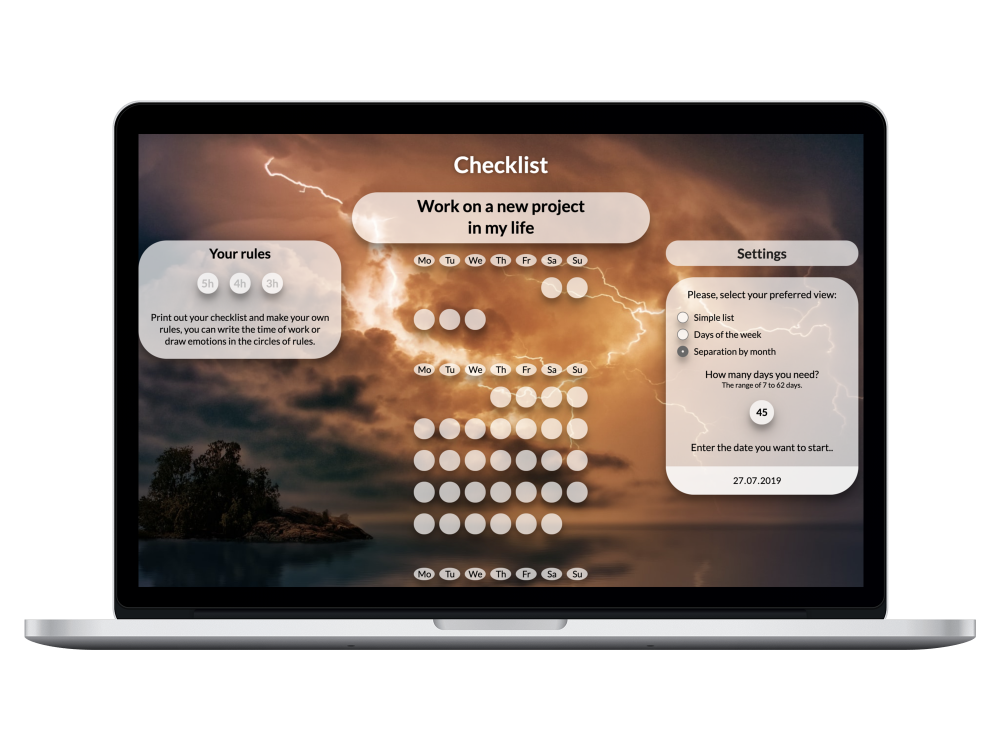
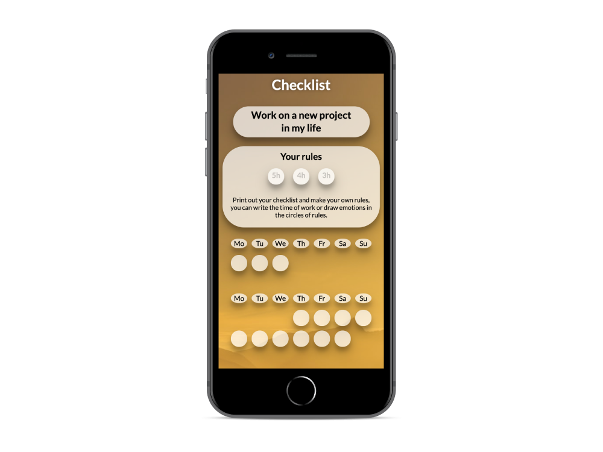
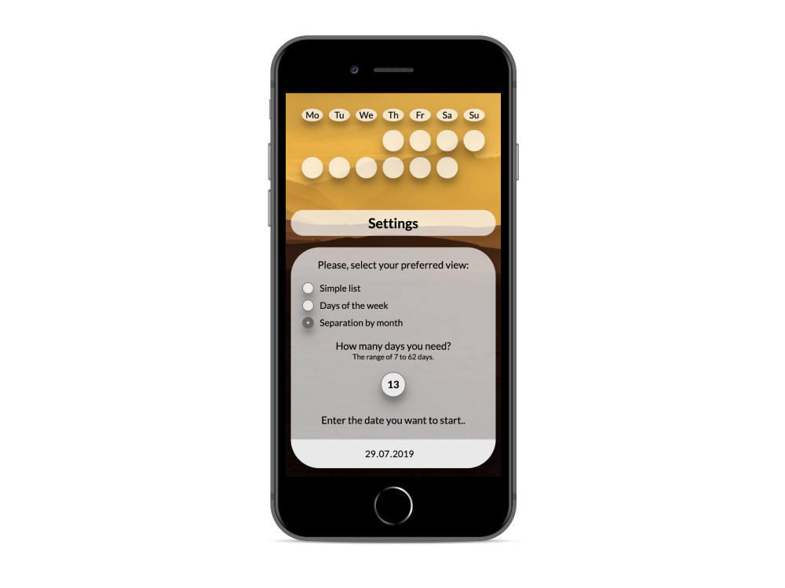

# Checklist

## Description

This is the simple printable checklist with 3 rules. You can choose view of checklist, choose how many days you want to keep track of something important stuff, and choose date, when you want to start this. The background of checklist is random photo from https://unsplash.com.

 

## How to use
* `git clone` this repository;
* `npm install` all dependencies;
*  type `npm start`, if you want to run your server; 
*  type `npm dev`, if you want to run NodeJS server.

Be careful...It's my first code lines.

